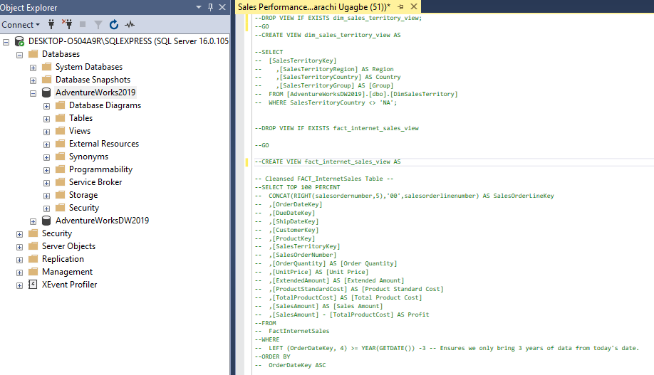
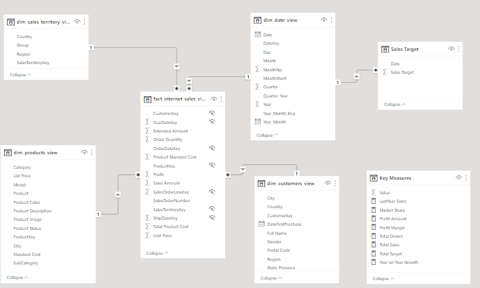
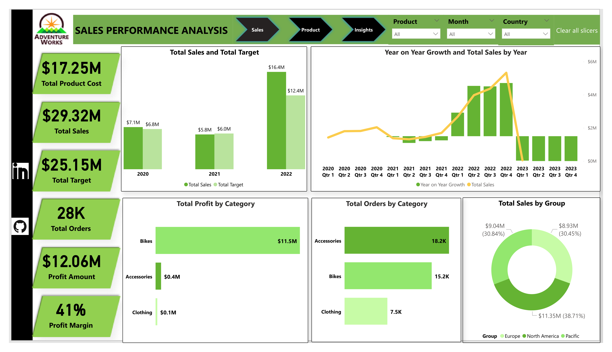

# Sales-Performance-Analysis
This is a project that shows my ability to query data from Adventure Works DW database Using SQL, thereafter using PowerBI to import, analyze and visualise
*(The  picture below is gotten from freepiks website)*

## Introduction

This is an analysis of the Sales performance of AdventureWorksDW. It is done by analyzing data from different schemas on the AdventureWorks DWdatabase. I anlyzed data from dim_customers table, dim_date table, dim_product table, dim_territory sales and fact_internet sales table. I used SQL to query the data from the database and imported into PowerBI where the actual analysis was carried out. 

**_Disclaimer_** This is not a real company as we know that adventure works DW database is compiled by Microsoft for learning purposes.

## Problem Statement

The goal of this analysis is to
- Determine the current market demand for products and how it varies by region/location
- Know the current sales performance and how it compares to past performance and industry benchmarks
- identify the areas where sales performance is lacking or could be improved.
- To discover target markets or goods that have the greatest impact on sales success.
- Finally, the goal is to create data-driven plans that can aid in increasing sales, improving customer happiness, and driving corporate growth.

## Skills and Concepts demonstrated:
 
 - SQL (Select, alias, Views)
 - PowerBI concepts like:
   - creating columns for calculations for dates, time, and duration
   - Creating key performance indicators (KPIs) and other business calculations,
   - Developing general DAX calculations that deal with text and numbers,
   - Performed advanced DAX calculations for solving statistical measures and other mathematical formulas
   - Data Modelling,
   - Measures,
   - filters,
   - tooltips, 
   - Page buttons,
   - Data Visualization
   
   ---
   
    ## Data Source:

The data used for this work is gotten from the AdventureWorks 2019 database 2019. I studied the Schema, Objects related to the Schema, data dictionary and found the right tables for the analysis. 

  - You can find a link to get started with installation and restoration of the database to your local machine.  [here:](https://youtu.be/VpY0Q_kwtIw) 
 ---
 
## Data Transformation:
- Several structured queries were written to get the right tables and then saved as views in the Database on SQL Management studio.
The tables and views are:
- Customers Table

- Date Table

- Product Table

- Territory and Sales Table

Note that i found a script that updated the dates. Part of it is shown here:

- These tables were then imported into PowerBI desktop for analysis. 

- I chose the necessary tables

I tranformed the data in Power Query, checked for Colum quality, consistent or appropriate data types.

I began writing several Dax and creating measures and calculated columns to get the right metrics for the Sales Performance analysis.

I also created Measures in a table named "Key Measures".

The queries i wrote on SQL are compiled and also uploaded here in this repository as [SalesPerformanceScript.sql](https://github.com/Amarabright/Sales-Performance-Analysis/blob/main/SalesPerformanceScript.sql)

---
## Data Modelling:

Tables were automatically joined by creating relationships with them, PowerBI does this intelligently. However, as someone that understands the dataset and want to get specific insights and information. I had to create other relationships and measures to enable me. so I did another model. I created a Star Schema that has 1 fact table and 5 dimension tables.

Recreated Model                     |  Automated Model
:--------------------------:        |    :-----------------------------------:
             |   

## Data Analysis and Visualization

Several expressions and functions were made to arrive at the desired KPI or Metrics.  
I arrived at a report with three (3) pages named:
- Sales Page
- Product Page and then 
- Insight Page

For some reasons that i don't understand maybe administrative reasons on the PowerBI service, the key Influencers Visual i used wasn't visible or maybe allow for use from my admin settings. I tried to find a way but could not. If i find a way, i will drop the link so you can interact with the report.

## Features of the Report

The first page is named Sales Page and it contains information regarding sales. The page has a Page Navigation button at the top, just by the right of the title of the report, so it helps with navigation to the other pages. The button is also on the second page, but the third page has a back button" that returns  to the Sales or Product Page.

- Sales Page

- Product Page

- InsightPage

### You can interact with the report [here.](https://app.powerbi.com/view?r=eyJrIjoiZTZjY2RiNTMtYTViYS00ZDUzLTkzOWUtMWEyOTg2MDgxNDUwIiwidCI6IjY0NTI5N2QxLWVkNmMtNDk0Ni1iNzg1LTE1MTI5MThlYmU2YiJ9)
---
## Analysis

 - There is a positive trend of sales going upwards and increasing especially in the quarters of 2022.
 
 - North America is the location(group) that has the highest sales which is 38.7%, followed by Pacific at 30.84%.
 
 - "Bikes" account for majority of the sales and profit of  $11.5 Million which is 95.4%. Accessory as a subcategory is the product with the greatest number of orders but lower revenue, this is due to price gap between both and for the fact that several accessories can be used to fix a damaged bike.

- USA has the highest sales and order. Sales is $9.37milllion which is approximately 32% of total sales and 35% of total order. This is followed by Australia which has a sales value of $9.04 million.

 - In 2020, total sales was slightly higher than the target (>by 300,000). In 2021, Total Sales was slightly lower than the total target(<by 200,000). In 2022, there was  much difference as Total sales was $4,000,000 higher than the Target. This is a success!

 - Total Sales increases when the Category is Bike and also when the order quantity is much. Total Sales decreases when Category is Clothing or Accessories.

  - Jordan Turner is the customer with highest purchasing value of $15,999 followed by Willie Xu of  $13,490 although Ashley Henderson had the highest order quantity.

 - Black Mountain Bikes have the highest order and sales followed by the Road Bikes.

---

## Recommendation

There are no doubts that the Business is performing well as the major product it is known for, is been sold (Bikes), However, there is room for more improvements.

 - The accessories and clothing subcategories are not doing much in sales. Strategies to increase the sales should be made like "discounted bundle-selling" where for any purchase of bike, accessories and clothing will be added as an offer in addition to the bikes but at a  discounted price which will be cheaper compared to when they are buying the accessories or clothing as a stand-alone product.

 - Use database to gather customer feedback to get their experiences about the product or services. This information can be used to identify areas for improvement.

 - Partner with local organization to promote bike riding in the community. This would help increase awareness of bike products and generate positive word of mouth marketing.

 - Understand Customers purchasing pattern by carrying out an analysis on this. This will tell what customers are buying, when they are buying  and how to promote the goods to the customers.

---

### Thank you for reading.

I am open for entry-level data anlalyst role.

Let us have discussion about your company and industry now!
